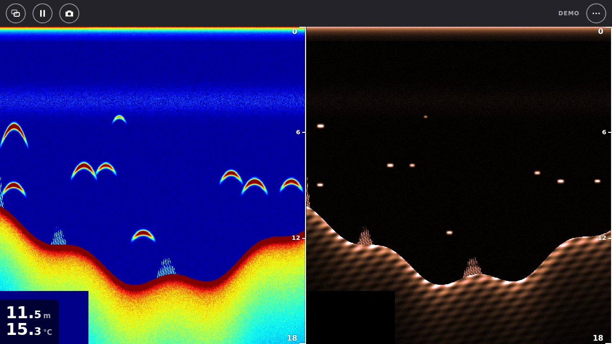
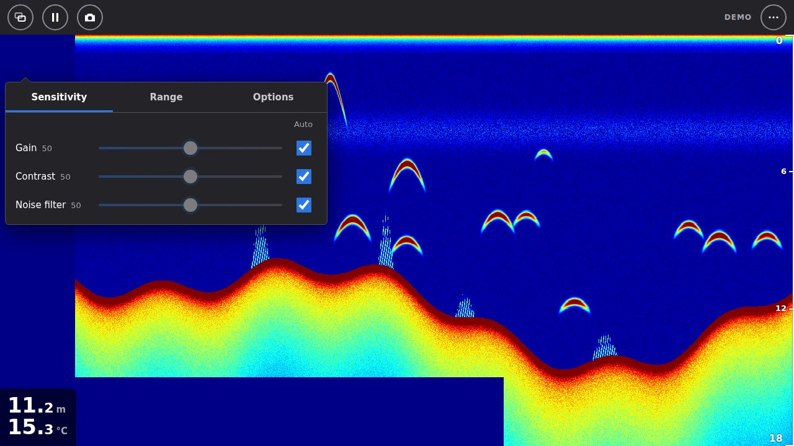

# signalk-wifish

Signal K plugin and web app for the Raymarine **Wi-Fish** and **Dragonfly-4/5/7 Pro**
Wi-Fi sonars. It does what the Android "Wi-Fish" app does, in a browser on any
device connected to your Signal K server:

- live **CHIRP sonar** and **DownVision** echograms, side by side or one at a time
- depth and water temperature readout, and both published to **Signal K**
- sonar adjustments sent to the unit: gain, contrast and noise filter (each with Auto),
  range (auto or shallow/deep), transducer depth and the unit's simulator
- pause and scroll back through history, pinch or mouse-wheel zoom with a zoom box,
  A-scope, depth lines, nine colour palettes, snapshots



**Status:** working on real hardware. The protocol was derived from static analysis of the
Android app and then validated against a unit: Wi-Fi discovery and session keepalive, CHIRP
sonar and DownVision echograms, depth and water temperature, settings changes and the
transducer offset all behave as the Android app does. Two clients can watch the same unit
at once. A built-in demo sonar lets you try everything without a unit.

## How it works

The sonar is a Wi-Fi access point. The machine running Signal K joins that network
(ideally on a second Wi-Fi interface, so Ethernet or another Wi-Fi stays the default
route, see [network setup](docs/network-setup.md)). The plugin listens for the sonar's
multicast announcement, keeps the session alive, decodes the "Sonar4" UDP protocol
([docs/PROTOCOL.md](docs/PROTOCOL.md)) and:

- publishes `environment.depth.belowTransducer` and `environment.water.temperature`
  (plus `environment.depth.belowSurface` or `belowKeel` when a transducer offset is set
  on the unit, with `surfaceToTransducer` / `transducerToKeel`). The unit holds one
  offset only; with it set to the keel, *Waterline to transducer* in the web app's
  settings adds `belowSurface` as well,
- streams echogram columns to the **Wi-Fish Sonar** web app, keeping recent history on the
  server so a browser opened later can scroll back (a new viewer receives at most about
  2 MiB of recent history as backlog, even when the server keeps more),
- relays settings changes from the web app to the unit.

## Install

From the Signal K App Store search for **signalk-wifish**, or:

```sh
cd ~/.signalk
npm install signalk-wifish
```

Restart the server, enable **Wi-Fish / Dragonfly sonar** under *Server → Plugin Config*,
then open **Wi-Fish Sonar** from the *Webapps* page (`http://<server>:3000/signalk-wifish/`).

### Access levels

Viewing the web app (echograms, depth, temperature) needs a Signal K login with at least
**readonly** access, or anonymous readonly access enabled on the server (*Security →
Settings*). Changing sonar settings (gain, contrast, noise filter, range, transducer depth,
units, simulator) needs **readwrite**. The plugin registers its routes at those levels, so
the app is not limited to admin users.

### Plugin options

| Option | Default | |
|---|---|---|
| Data source | `device` | `device` = the sonar on the joined Wi-Fi, `demo` = built-in simulated sonar, `replay` = a raw capture file |
| Wi-Fi interface address | empty | explicit local IPv4 on the sonar Wi-Fi; until an interface has that address (the sonar is off, so its DHCP has given none) the plugin reports that it is waiting, not an error, and retries every 5 s. Empty = automatic: discovery listens on every `192.x` interface and the session joins every one of them on the announced sonar's subnet (all of them when none matches, e.g. a `/32` address), so overlapping subnets and the `/32` setup in [network setup](docs/network-setup.md) work without it |
| Control the sonar | on | send keepalives and settings; off = passive listener |
| Replay file | empty | **absolute** path of a capture made with `tools/wifish-probe.mjs --log`. With `replay` selected and no file, the plugin reports an error instead of silently running the demo |
| Demo model | `dragonfly` | `dragonfly` (sonar + DownVision) or `wifish` (DownVision only) |
| History columns per channel | 1500 | echogram history kept on the server |
| Publish depth / water temperature | on | Signal K output |

Depth is sent on change (at most 5 Hz) and re-sent every 5 s as a heartbeat even when the
value has not changed; temperature at most once per second, with a 10 s heartbeat. Both
become `null` when the bottom is lost or the link drops, so displays don't show a stale
depth.

The `demo` source publishes **simulated** depth and water temperature into the Signal K
data model exactly like a real unit would. On a boat, turn off *Publish depth / water
temperature* while trying the demo, or don't use the demo there at all.

## Using the web app

The screen follows the Android app:

| | |
|---|---|
| Toolbar | view switcher, pause/resume, snapshot, and ⋯ for Settings, Help and About. On a Wi-Fish (DownVision only) the first button opens the sonar settings instead. |
| Tap a trace | shows its ⚙ button for 5 s; it opens the **Sensitivity / Range / Options** popover for that channel |
| Drag sideways | scroll back through history (pauses); ⏩ or dragging to the end returns to live |
| Pinch vertically | zoom into the water column; the zoom box on the right shows the full range and follows the bottom. Double-tap to zoom out. |
| Pinch horizontally | scroll speed |
| Mouse and trackpad | Ctrl + wheel or Alt + wheel: scroll speed; trackpad pinch (and plain wheel): zoom. Shift + wheel (or a sideways wheel) scrolls through history. |
| History scrollbar | shown while paused; keyboard-operable: Tab to it, then Arrow keys step back and forward, Page Up / Page Down move a screen, Home shows the oldest pings and End returns to live |
| Press and hold | depth, bottom, water temperature and time at that point |
| ⋯ → Settings | transducer depth, waterline to transducer, depth and temperature units, simulator |



Depth and temperature units and the waterline-to-transducer distance are kept by the plugin
(in its data directory), so they are the same on every browser and device and survive restarts. Palettes, view and similar
preferences are stored per browser.

## Development

Node.js 20+ to run the plugin; development tools (vite/vitest) need Node 20.19+ or 22.12+.

```sh
npm install
npm run build        # dist/ and public/ (npm pack and publish build too)
npm test             # type-check, then vitest
npm run dev          # web app with the demo sonar on http://localhost:3000/ (listens on 127.0.0.1)
npm run dev -- --host 0.0.0.0                    # share it on the LAN (npm needs the `--`)
node dist/devserver.js --demo --wifish            # Wi-Fish (DownVision only)
node dist/devserver.js --device [--iface 192.168.x.y] [--passive] [--deltas]
node dist/devserver.js --replay capture.bin
npm run watch:web    # rebuild the web app on change
```

| Path | What |
|---|---|
| [`src/sonar4.ts`](src/sonar4.ts) | pure protocol codec: parsers, keepalive, settings read-modify-write, ping reassembly |
| [`src/session.ts`](src/session.ts) | protocol state from any transport; builds settings commands |
| [`src/device.ts`](src/device.ts) | UDP transport: discovery, keepalive, reconnect |
| [`src/demo.ts`](src/demo.ts), [`src/replay.ts`](src/replay.ts) | demo sonar and capture replay transports |
| [`src/engine.ts`](src/engine.ts) | Signal K deltas, state and echogram history |
| [`src/api.ts`](src/api.ts), [`src/plugin.ts`](src/plugin.ts) | HTTP/SSE API and the plugin |
| [`web/`](web) | the web app (TypeScript, canvas, no framework), bundled to `public/` |
| [`tools/`](tools) | `wifish-probe.mjs` (hardware test client, raw logging) and `dump-raw.mjs` |
| [`docs/`](docs) | protocol and network setup |

### Probe tools

```sh
npm run build:server
node tools/wifish-probe.mjs --iface <wlan IP> --log raw.bin
node tools/wifish-probe.mjs --iface <wlan IP> --sk 127.0.0.1:<signalk udp port>
node tools/wifish-probe.mjs --iface <wlan IP> --no-keepalive   # passive test
node tools/wifish-probe.mjs --replay raw.bin                   # decode a capture, no device needed
node tools/dump-raw.mjs raw.bin --id 0x270104 --hex
```

## Roadmap

- [x] Validate on hardware: connection, sonar data, settings and depth/temperature output
- [x] Confirm the transducer offset convention (depth reference)
- [x] Resolve the ❓ fields in the protocol doc, as far as a Wi-Fish shows them
  ([docs/PROTOCOL.md §8](docs/PROTOCOL.md)): supply voltage, firmware version,
  device serial, bottom-record channel, the four message types the app ignores
  and the settings limits. What is left needs a Dragonfly (CHIRP channel,
  multi-segment ping columns); how it affects decoding and display is still untested
- [x] Signal K server plugin (TypeScript, vitest)
- [x] Echogram stream and web UI
- [ ] Waypoints (the app syncs them from the Dragonfly over TCP) as Signal K
  resources — needs a Dragonfly: a Wi-Fish announces only the sonar service, no
  waypoint service, since it has no GPS or waypoint store

## Legal

Independent interoperability work, not affiliated with or endorsed by Raymarine. This
repository contains no Raymarine code or artwork; the protocol was documented for
interoperability with hardware the author owns. Raymarine, Wi-Fish and Dragonfly are
trademarks of their respective owners.
